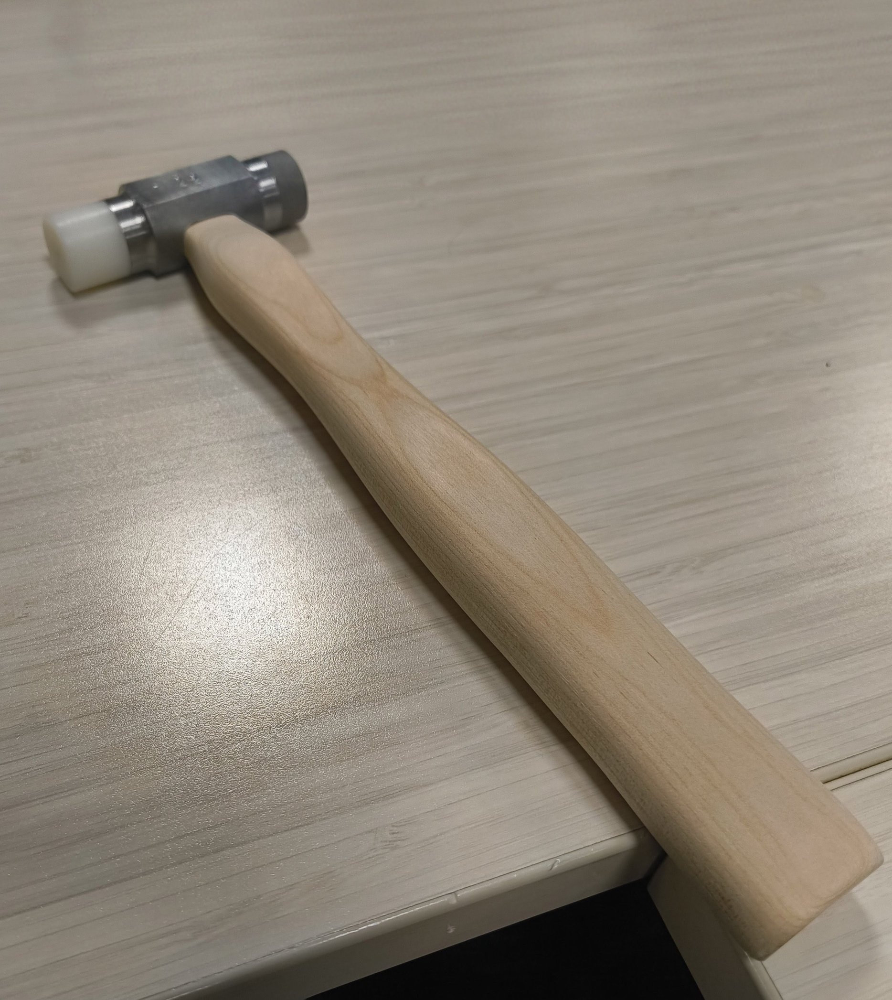

```{=html}
<div class="projects-container">

  <!-- Project Card 1 -->
  <div class="project-card">
    <h3 class="project-title">Intro to Eng. Design and Manufacturing (E4)</h3>
    <div class="project-body">
      <div class="project-image">
        
      </div>
      <div class="project-info">
        <p class="project-tag">Skills: </p>
        <p>Describe your project here. What was the goal? What did you design or build? What tools and techniques did you use? What was the outcome?</p>
      </div>
    </div>
  </div>

  <!-- Project Card 2 -->
  <div class="project-card">
    <h3 class="project-title">Intro to Eng. Systems (E79)</h3>
    <div class="project-body">
      <div class="project-image">
        
      </div>
      <div class="project-info">
        <p class="project-tag">Skills: </p>
        <p>Describe your project here. What was the goal? What did you design or build? What tools and techniques did you use? What was the outcome?</p>
      </div>
    </div>
  </div>

  <!-- Project Card 3 -->
  <div class="project-card">
    <h3 class="project-title">Experimental Engineering (E80)</h3>
    <div class="project-body">
      <div class="project-image">
        
      </div>
      <div class="project-info">
        <p class="project-tag">Skills: </p>
        <p>Describe your project here. What was the goal? What did you design or build? What tools and techniques did you use? What was the outcome?</p>
      </div>
    </div>
  </div>

  <!-- Project Card 4 -->
  <div class="project-card">
    <h3 class="project-title">Digital Electronics and Computer Eng. (E85)</h3>
    <div class="project-body">
      <div class="project-image">
        
      </div>
      <div class="project-info">
        <p class="project-tag">Skills: </p>
        <p>Describe your project here. What was the goal? What did you design or build? What tools and techniques did you use? What was the outcome?</p>
      </div>
    </div>
  </div>

</div>
```